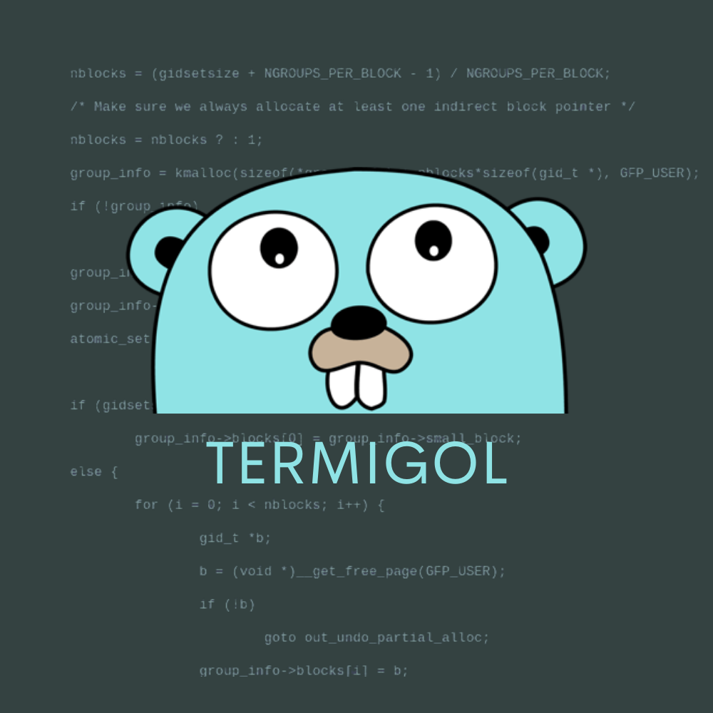

<h1 align="center">Welcome to Termigol 💻</h1>

<div align="center">
    
</div> 

***

> A bad terminal-kinda project written in Go


## Description 📝

I really enjoy learning new stuff, and the easiest path for me is by doing a project.  
I was curious about [Golang](https://golang.org/) and how to use it, so I decided to create a simple terminal emulator.  
> This project does not want in any way be a product, the-best-solution nor compete with any other similar project, this is just a the result of a learning process :stuck_out_tongue:

## How to use :pencil2:

```go run termigol.go```

## Author

👤 **Vinicius Kammradt**

* Website: https://kammradt.now.sh/
* Twitter: [@kammzinho](https://twitter.com/kammzinho)
* Github: [@kammradt](https://github.com/kammradt)
* LinkedIn: [@vinicius-kammradt](https://linkedin.com/in/vinicius-kammradt)
